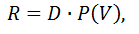
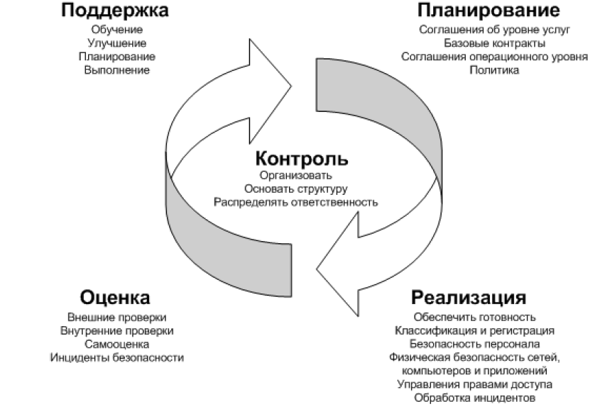
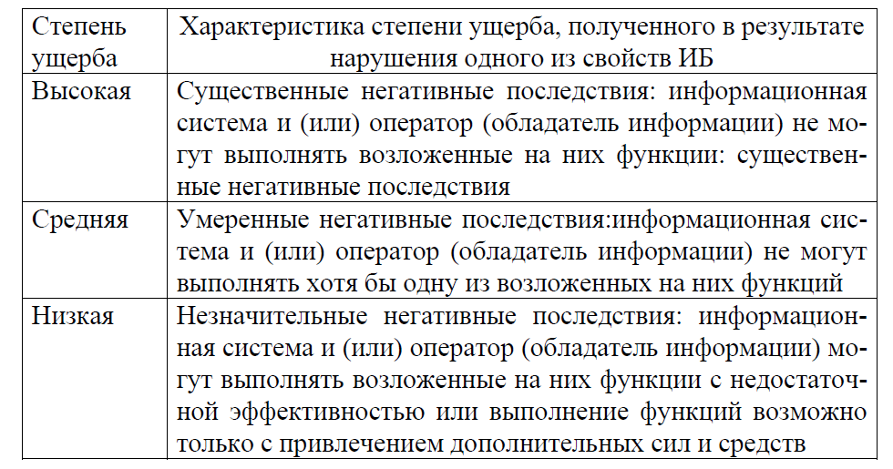

**Теоретические вопросы**

**1. Предпосылки развития менеджмента в сфере информационной
безопасности.**

-Под понятием \"**информационная безопасность**\" принято иметь в виду
состояние (уровень) защищенности информационных ресурсов --
информационных объектов и информационных систем -- от негативных
воздействий (как случайных, так и осуществляемых преднамеренно), которые
могут нанести ущерб самой информации и средствам ее передачи и
обработки, а, следовательно, отрицательно отразиться на владельцах
информационных ресурсов, государстве, обществе и других участниках
процессов информационного обмена. Под **информационной безопасностью** в
более общем виде следует понимать совокупность средств, методов и
процессов (процедур), обеспечивающих защиту информационных активов и,
следовательно, гарантирующих сохранение эффективности и практической
полезности как технической инфраструктуры информационных систем, так и
сведений, которые в таких системах хранятся и обрабатываются.

Понятие информационной безопасности неразрывно связано с **рисками** для
информационных ресурсов, под которыми (рисками) понимается возможность
(вероятность) нанесения ущерба информационным ресурсам, снижения уровня
их защищенности.

**2. Основные направления развития менеджмента в сфере информационной
безопасности.**

Во всем комплексе деятельности по защите информации одно из наиболее
важных мест занимает **организационно-управленческая деятельность --
организационное обеспечение информационной безопасности**, которое
представляет собой одно из четырех основных направлений работы в общей
системе мер в сфере информационной безопасности, включающей в себя также
разработку специализированного программного обеспечения, изготовление и
использование специальных аппаратных средств и совершенствование
криптографических (математических) методов защиты информации

{width="5.041666666666667in"
height="1.7280161854768155in"}

Основными задачами организационно-управленческой деятельности
(менеджмента) в сфере информационной безопасности являются:

-   обеспечение комплексности всех решений, реализуемых в процессе
    обеспечения информационной безопасности;

-   обеспечение непрерывности и целостности процессов информационной
    безопасности;

-   решение методических задач, лежащих в основе эффективного управления
    информационной безопасностью, таких, как вопросы управления рисками,
    экономическое моделирование и т.п.;

-   управление человеческими ресурсами и поведением персонала с учетом
    необходимости решения задач информационной безопасности.

**3. Международные профессиональные объединения в сфере информационной
безопасности.**

В числе международных организаций, действующих в сфере информационной
безопасности и оказывающих существенное влияние на функционирование
глобальных информационных систем и деятельность всего информационного
сообщества, выделяются организации следующих типов:

1\. Крупные международные некоммерческие и неправительственные
организации, объединяющие специалистов в определенных областях,
существующие, как правило, уже в течение многих лет и охватывающие
множество основных направлений развития компьютерной инженерии,
электроники и телекоммуникаций, включая в том числе и определенные
вопросы обеспечения безопасности современных информационных технологий.

2.  Отдельные относительно небольшие организации, которые
    специализируются на более или менее узких вопросах информационной
    безопасности, имеющих глобальное значение для всего сообщества
    пользователей информационных систем, и появились на базе частных
    компаний или исследовательских структур в течение последнего
    десятилетия, когда проблемы информационной безопасности стали
    особенно актуальными.

3.  Совместные структуры (комитеты, альянсы и т.п.), создаваемые (иногда
    временно) крупными компаниями (иногда при участии крупных
    исследовательских центров, учебных заведений и правительственных
    структур) для решения определенных задач в сфере информационных
    технологий и информационной безопасности.

Каждый из них, в свою очередь, имеет свои специфические организационные
особенности, однако все они, как правило, решают задачу разработки,
согласования и дальнейшего распространения общих для всего сообщества
пользователей информационных систем технических и организационных
решений, таких как:

-   протоколы глобальных сетей;

-   архитектуры, алгоритмы, протоколы публичных средств шифрования
    данных;

-   правила построения глобальных сетей обмена данными и других
    элементов глобальной инфраструктуры информационной безопасности.

**4. Специализированные международные организации в сфере информационной
безопасности**

Специализированные организации, имеющие глобальное влияние на управление
информационной безопасностью на различных уровнях и общее состояние
информационной безопасности, как правило, могут функционировать на базе:

-   частных компаний, занимающихся исследованиями, разработками и
    консультированием в сфере информационной безопасности;

-   крупных учебных заведений, специализирующихся на информационных
    технологиях, а также обладающих существенным авторитетом и
    финансовыми ресурсами;

-   правительственных учреждений, ответственных за обеспечение
    информационной безопасности в определенных сферах.

Ввиду того, что такая форма организационной работы основана на частных
компаниях и относительно небольших учреждениях, подходы к организации и
управлению обычно не подчиняются каким-либо общим правилам. Также состав
таких организаций может со временем меняться: на смену одним
исследовательским центрам могут приходить другие -- более успешные и
эффективные -- с теми же функциями. В настоящее время можно выделить
следующие наиболее значимые организации, занимающие эту нишу:

-   CERT Coordination Center -- Координационный центр CERT;

-   Исследовательская группа X-Force компании IBM.

**5. Основные этапы разработки системы управления информационной
безопасностью на предприятии.**

В соответствии со стандартом ISO 27001 ***система менеджмента защиты
информации (система управления информационной безопасностью)*** -- это
часть общей системы менеджмента, основанной на подходе деловых рисков, с
целью создать, внедрить, эксплуатировать, постоянно контролировать,
анализировать, поддерживать в рабочем состоянии и улучшать защиту
информации.

Система управления информационной безопасностью включает в себя
организационную структуру, политику, деятельность по планированию,
ответственность, практики, процедуры, процессы и ресурсы.

Система управления информационной безопасностью разрабатывается для
того, чтобы обеспечить выбор адекватных и пропорциональных средств
управления защитой, которые защищают информационные активы и придают
уверенность заинтересованным сторонам на предприятии.

Создание системы управления информационной безопасностью **(**СУИБ) на
предприятии и подготовка к ее сертификации на соответствие требованиям
стандарта ISO 27001, как правило, делится на два основных этапа:

1)  разработку системы управления (и всех необходимых процедур);

2)  внедрение системы управления.

Для выполнения первого этапа рекомендуется приглашать консультантов.
Второй этап (внедрение) выполняется самой компанией (специалисты
компании должны ознакомиться с необходимыми процедурами, наладить их
четкое выполнение, проверять и контролировать их эффективность и пр.).

Выделяются следующие **основные этапы разработки** СУИБ:

1\) инвентаризация активов;

2\) категорирование активов;

3\) оценка защищенности информационной системы;

4\) оценка информационных рисков;

5\) обработка информационных рисков (в том числе определение конкретных
мер для защиты ценных активов);

6\) внедрение выбранных мер обработки рисков;

7\) контроль выполнения и эффективности выбранных мер.

**6. Инвентаризация активов компании, категорирование активов
компании.**

**1.Инвентаризация активов компании**

На этом этапе прежде всего, следует определить, что является ценным
активом компании с точки зрения информационной безопасности. Стандарт
ISO 17799, подробно описывающий процедуры системы управления ИБ,
выделяет следующие виды активов:

1)  информационные ресурсы (базы и файлы данных, контракты и соглашения,
    системная документация, научно-исследовательская информация,
    документация, обучающие материалы и пр.);

2)  программное обеспечение,

3)  материальные активы (компьютерное оборудование, средства
    телекоммуникаций и пр.);

4)  сервисы (поддерживающая инфраструктура);

5)  сотрудники компании, их квалификация и опыт,

6)  нематериальные ресурсы (репутация и имидж компании).

***Инвентаризация*** заключается в составлении ***перечня ценных активов
компании***. Как правило, данный процесс выполняют владельцы активов.

**2 Категорирование активов компании**

В процессе категорирования активов необходимо оценить их критичность для
бизнес-процессов компании или, другими словами, определить, какой ущерб
понесет компания в случае нарушения информационной безопасности активов.

Данный процесс вызывает наибольшую сложность, так как ценность активов
определяется на основе экспертных оценок их владельцев. В процессе
данного этапа часто проводятся обсуждения между консультантами по
разработке системы управления и владельцами активов. Это помогает
последним понять, каким образом следует определять ценность активов с
точки зрения информационной безопасности (как правило, процесс
определения критичности активов является для владельца новым и
нетривиальным). Кроме этого, для владельцев активов разрабатываются
различные методики оценки. В частности, такие методики могут содержать
конкретные критерии (актуальные для данной компании), которые следует
учитывать при оценке критичности.

**7.Оценка защищенности информационной системы компании.**

Очевидно, что для анализа информационных рисков необходимо оценить не
только критичность активов, но и уровень их защищенности.

В процессе оценки защищенности информационной системы определяются
угрозы, действующие на активы, а также уязвимости информационной
системы, в которой обрабатываются активы и которые могут привести к
реализации угроз. Угрозы и уязвимости рассматриваются только во
взаимосвязи друг с другом. Уязвимость, через которую невозможно
реализовать ни одну из угроз, не имеет смысла. Аналогично, угроза,
которую невозможно реализовать ввиду отсутствия уязвимости, также
неактуальна.

Не вызывает сомнения, что различные угрозы и уязвимости имеют разное
значение (разный вес) для информационной системы. Например,
злоумышленник скорее решит воспользоваться открытой дверью, чем открытым
окном, если офис компании расположен на семнадцатом этаже 34-этажного
здания (однако совсем исключать вторую возможность не стоит).
Следовательно, необходимо определить, какие угрозы и уязвимости наиболее
актуальны, а какие менее значимы, или, другими словами, определить
вероятность реализации угрозы через уязвимость. Вероятность реализации
уязвимостей (как и любая другая вероятность) определяется в пределах от
0 до 1 (или от 0 до 100 %).

Угрозы, уязвимости, а также их вероятности определяются в результате
проведения технологического аудита защищенности информационной системы
компании. Такой аудит может быть выполнен как специалистами компании
(так называемый, внутренний аудит), так и сторонними консультантами
(внешний аудит).

**8. Оценка и обработка информационных рисков компании.**

Оценка информационных рисков заключается в расчете рисков, который
выполняется с учетом сведений о критичности активов, а также
вероятностей реализации уязвимостей.

{width="1.0409722222222222in"
height="0.25416666666666665in"}Классическая формула оценки рисков:

где R --- информационный риск; D --- критичность актива (ущерб);

P(V) --- вероятность реализации уязвимости.

Результаты оценки рисков, как правило, представляются в «Отчете об
оценке информационных рисков компании».

**Обработка информационных рисков**

Обработка информационных рисков --- это этап, в процессе которого
определяется, какие действия по отношению к рискам требуется выполнить в
компании.

Основными способами обработки рисков являются:

1\. Принятие рисков.

2\. Уклонение от рисков.

3\. Передача рисков.

4\. Снижение рисков.

***Принятие рисков*** осуществляется в том случае, если уровень рисков
признается приемлемым. Значит, компания не считает целесообразным
применять какие-либо меры по отношению к этим рискам и готова понести
ущерб.

***Уклонение от рисков*** --- это полное устранение источника риска.

***Передача рисков*** --- перенесение ответственности за риск на третьи
лица (например, поставщику оборудования или страховой компании) без
устранения источника риска.

***Снижение рисков*** --- это выбор и внедрение мер по снижению
вероятности нанесения ущерба.

**9.Внедрение выбранных мер обработки рисков.**

Внедрение процедур, как правило, заключается в информировании
соответствующих сотрудников о правилах и сроках выполнения процедуры,
регулярном контроле выполнения процедуры, а также оценки ее
эффективности, внесении корректирующих и превентивных действий. То есть,
по сути, внедрение всего цикла PDCA-модели для каждой процедуры.

Как правило, консультанты по разработке и внедрению системы управления
ИБ разрабатывают план внедрения системы управления, в котором описывают
четкую последовательность действий при внедрении процедур, методы
контроля и осуществления проверок выполнения процедуры.

Систему управления ИБ можно считать внедренной и эффективно
функционирующей на практике тогда, когда все ее процедуры хотя бы один
раз пройдут этапы модели PDCA, когда будут найдены и решены проблемы,
возникающие при внедрении процедур

**10. Контроль выполнения и эффективности выбранных мер**

Реализация данного этапа заключается в выполнении процедуры постоянного
контроля и анализа для того, чтобы:

1\) быстро обнаруживать ошибки в результатах обработки;

2\) быстро выявлять предпринимаемые и успешные нарушения защиты и
инциденты;

3\) дать руководству возможность определять, осуществляются ли виды
деятельности по защите, назначенные людям или осуществляемые
информационной технологией, как ожидалось;

4\) помогать обнаруживать события в системе защиты информации и тем
самым предотвращать инциденты в системе защиты информации путем
использования индикаторов;

5\) определять, были ли действия, предпринятые для улаживания проблемы с
нарушением защиты, результативными

Кроме того необходимо:

-   предпринимать регулярный анализ результативности СУИБ (включая
    соответствие политике и целям СУИБ, а также анализ средств
    управления защитой), принимая во внимание результаты аудитов защиты,
    инциденты, результаты измерений результативности, предложения и
    обратную реакцию всех заинтересованных сторон.

-   измерять результативность средств управления для того, чтобы
    проверить, что требования защиты были удовлетворены.

-   анализировать оценки риска через запланированные интервалы и
    анализировать остаточные риски и определенные приемлемые уровни
    риска, принимая во внимание изменения в следующем:

1\) организация;

2\) технология;

3\) деловые цели и процессы;

4\) выявленные угрозы;

5\) результативность реализованных средств управления;

6\) внешние события, такие как изменения в законодательной или
нормативно-правовой среде, измененные договорные обязательства, а также
изменения в социальном климате.

-   проводить внутренние аудиты СУИБ через запланированные интервалы
    (см. раздел 6 ISO/IEC 27001).

-   регулярно осуществлять анализ СУИБ со стороны руководства, с целью
    гарантировать, что область применения остается адекватной, и
    выявляются улучшения в процессе СУИБ.

-   обновлять планы защиты для того, чтобы учесть данные, полученные в
    ходе деятельности по постоянному контролю и анализу.

-   записывать действия и события, которые могли оказать негативное
    влияние на результативность или качество работы СУИБ.

**Денис**

**11. Основы обеспечения режима информационной безопасности на**

**предприятии.**

**12. Основы анализа информационных рисков компании.**

**13. Формирование политики информационной безопасности на**

**предприятии.**

**14. Способы управления безопасностью информационных технологий.**

**15. Исходные данные и состав политики безопасности**

**информационных технологий предприятия.**

**16. Политика безопасности информационных технологий.**

**17. Назначение и функции департамента информационной**

**безопасности предприятия.**

**18. Организационная структура и персонал департамента**

**информационной безопасности.**

**19. Особенности работы с персоналом предприятия, обладающим**

**конфиденциальной информацией.**

**20. Назначение, цели и этапы аудита состояния информационной**

**безопасности предприятия.**

**21. Содержание основных этапов аудита состояния информационной**

**безопасности предприятия.**

Основными этапами проведения аудита являются:

-   инициирование проведения аудита;

-   непосредственно осуществление сбора информации и проведение
    обследования аудиторами;

-   анализ собранных данных и выработка рекомендаций;

-   подготовка аудиторского отчета и аттестационного заключения.

Аудит должен быть инициирован руководством предприятия с достаточно
четко сформулированной целью на определенном этапе развития
информационной системы или системы обеспечения информационной
безопасности предприятия (например, после завершения одного из этапов
внедрения).

В случае если аудит не является комплексным, на начальном этапе
необходимо определить его непосредственные границы:

-   перечень обследуемых информационных ресурсов и информационных систем
    (подсистем);

-   перечень зданий, помещений и территорий, в пределах которых будет
    проводиться аудит;

-   основные угрозы, средства защиты от которых необходимо подвергнуть
    аудиту;

-   элементы системы обеспечения информационной безопасности, которые
    необходимо включить в процесс проверки (организационное, правовое,
    программно-техническое, аппаратное обеспечение).

Основная стадия -- **проведение аудиторского обследования и сбор
информации** -- как правило, должно включать в себя:

-   анализ имеющейся политики информационной безопасности и другой
    организационной документации;

-   проведение совещаний, опросов, доверительных бесед и интервью с
    сотрудниками предприятия;

-   проверку состояния физической безопасности информационной
    инфраструктуры предприятия;

-   техническое обследование информационных систем -- программных и
    аппаратных средств (инструментальная проверка защищенности).

**22. Анализ собранной информации и заключение при аудите состояния**

**информационной безопасности предприятия.**

**Анализ** всей информации, полученной в процессе ознакомления с
документацией, контроля фактического выполнения всех установленных
требований, получения сведений от сотрудников, изучения работы
аппаратных средств и программного обеспечения, проверки физической
защищенности и проведения инструментальных проверок должен быть
произведен с учетом выявленных рисков и потребностей предприятия в
информационной безопасности.

В частности, такой анализ предполагает выявление конкретных особенностей
программных и аппаратных средств, бизнес-процедур, организационных
правил и распределений функциональных обязанностей и полномочий, которые
могут негативно повлиять на обеспечение информационной безопасности, а
также описание причинно-следственных взаимосвязей между выявленными
особенностями функционирования предприятия и увеличением рисков
нарушения информационной безопасности. Все исследованные обстоятельства,
выявленные недостатки и особенности должны быть обобщены, и таким
образом должно быть сформировано общее представление о состоянии
информационной безопасности на предприятии, отражены основные
достоинства и недостатки действующей системы защиты информационных
ресурсов, а также обозначены основные приоритеты и направления ее
дальнейшего развития и совершенствования.

**23. Характеристика этапов реагирования на инциденты**

Под **инцидентом** понимается какое-либо отклонение от нормального
процесса использования информационных ресурсов и функционирования
информационных систем, повлекшее ущерб для определенных информационных
активов предприятия или непосредственно создающее угрозу нанесения
такого ущерба.

Чрезвычайная ситуация (инцидент), связанная с нарушением информационной
безопасности, может быть обусловлена:

-   разрушительным воздействием на весь имущественный комплекс
    предприятия при возникновении стихийных факторов (наводнение, пожар,
    землетрясение и т.п.) или целенаправленном нападении (подрыв,
    поджог, разрушение зданий и помещений и т.п.);

негативным воздействием исключительно на информационные ресурсы
предприятия (как правило, осуществляемым удаленно, с использованием
телекоммуникационных каналов).

В общем случае организационные процедуры (регламенты) реагирования на
чрезвычайные ситуации должны включать в себя:

1)  регламенты альтернативных процессов обработки информации (в том
    числе, возможно, и без использования средств автоматизации) на
    период выхода из строя основных информационных ресурсов;

2)  определение групп персонала, ответственных за выполнение тех или
    иных функций в случае возникновения чрезвычайной ситуации, а также
    определение процедур взаимодействия между группами и отдельных групп
    с руководством предприятия;

3)  техническую и организационную документацию, необходимую для
    восстановления информационных систем и данных после чрезвычайной
    ситуации;

4)  порядок хранения архивных (резервных) копий данных и программных
    приложений обработки данных в местах, защищенных от механических
    воздействий, краж, наводнений, пожаров и т.п. (в т.ч., возможно, в
    местах, территориально удаленных от основных мест хранения и
    обработки информации);

5)  соглашения с поставщиками программных и аппаратных средств, входящих
    в информационную инфраструктуру предприятия, о срочной поставке
    компонент, вышедших из строя и требующих замены в случае
    чрезвычайной ситуации.

**24. Оценка ущерба от инцидента в сфере информационной**

**безопасности.**

Важной составляющей анализа нападения также является **оценка ущерба от
произошедшего нарушения информационной безопасности**. Ущерб может быть
оценен одновременно с нескольких точек зрения и зависит от характера
возникшей внештатной ситуации. Наиболее простым для количественной
экономической оценки является прямой ущерб: затраты на восстановление
утраченной информации (могут быть рассчитаны на основе трудоемкости
работ по восстановлению информации и данных о средней стоимости рабочего
времени соответствующих специалистов), затраты на замену
скомпрометированных паролей, кодов и ключей, стоимость поврежденного
оборудования, штрафные санкции за разглашение конфиденциальной
информации (если такие санкции, например, были предусмотрены договорами
с подрядчиками, поставщиками или заказчиками) и т.п.

Также в оценке нуждается упущенная выгода, которая может быть связана
как с непосредственным прекращением (приостановкой, замедлением) текущих
операций предприятия, так и с долгосрочным (перспективным) негативным
влиянием возникшей внештатной ситуации -- потерей доверия к предприятию,
приводящей к оттоку заказчиков, формированием негативного имиджа
предприятия и т.п. Отдельно также может быть оценено падение рыночной
стоимости предприятия -- его акций (если речь идет о предприятии, акции
которого котируются на биржевом рынке).

Наиболее сложным для оценки является моральный ущерб и последствия от
разглашения информации личного характера (например, сведений,
составляющих врачебную тайну).

**25. Предпосылки развития рынка услуг по обеспечению**

**информационной безопасности и его структура.**

Развитие современных информационных технологий, рост зависимости
деятельности многих предприятий и учреждений от функционирования
информационных систем и постоянное нарастание объемов и сложности
информационных потоков привели к тому, что задачи обеспечения
информационной безопасности стали требовать использования значительных
ресурсов. В частности, финансовые средства, выделяемые на обеспечение
информационной безопасности, занимают все большую долю в бюджетах
предприятий, а текущее и стратегическое управление защитой информации
требует большего внимания не только со стороны специалистов по
информационным технологиям, но и со стороны руководителей и
собственников предприятий.

Таким образом, сложились предпосылки для формирования рынка различных
услуг по обеспечению информационной безопасности, которые (услуги)
помогли бы не только повысить эффективность защиты информационных
ресурсов, но и оптимизировать издержки предприятий и организаций.
Основными факторами, которые обусловили появление у предприятий
потребностей в услугах сторонних фирм, решающих задачи обеспечения
информационной безопасности, и выделение услуг по защите информационных
ресурсов в самостоятельную сферу бизнеса, стали:

-   усложнение и постоянное развитие современных систем обработки,
    хранения и передачи информации;

-   усложнение программных и аппаратных средств, используемых для защиты
    информации, необходимость понимания сложного комплекса теоретических
    и методических вопросов для их эффективной эксплуатации;

-   рост числа инцидентов и разнообразия видов атак на информационные
    системы и их интенсивности;

-   нехватка квалифицированных специалистов в сфере информационной
    безопасности и рост затрат на их содержание и профессиональную
    подготовку.

**26. Особенности некоторых видов услуг в сфере информационной**

**безопасности.**

**Услуги по реагированию на инциденты (нарушения информационной
безопасности)**, являются одним из наиболее характерных примеров
обоснованности и целесообразности передачи сервисов безопасности на
аутсорсинг. В частности, целесообразность отказа от самостоятельного
выполнения функций реагирования на инциденты и их (функций)
централизации в специализирующейся на таких задачах компании связана с
тем, что эта деятельность имеет следующие важные особенности:

-   требует постоянного (круглосуточного) дежурства, что предполагает
    содержание в штате как минимум пяти специалистов;

-   предполагает наличие высококвалифицированных (а следовательно,
    высокооплачиваемых и востребованных на рынке труда) специалистов,
    способных быстро предпринять эффективные меры противодействия
    возникающим угрозам (в том числе и применить контрмеры к нападающим
    в процессе длящейся атаки), а также самостоятельно принять
    необходимые решения в процессе отражения длящейся атаки;

-   загрузка дежурных специалистов, отвечающих за реагирование на
    инциденты, может быть крайне неравномерной.

Помимо уже указанных факторов, которые обуславливают необходимость
проведения именно внешних аудитов, а не внутренних (более высокая
квалификация специалистов, право делать заключения о соответствии
международным стандартам и т.п.), важным является также и то
обстоятельство, что внешние аудиторы, как правило, не заинтересованы в
представлении необъективной информации (в отличие от внутренней службы
информационной безопасности). В случае же, если предприятие захочет
создать собственную независимую службу для проведения аудитов
информационной безопасности (отдельно от департамента информационной
безопасности и других подразделений предприятия), результатом могут
оказаться очень большие затраты, тем более что частота проведения таких
аудитов, как правило, является не очень большой.

**27. Страхование информационных рисков компании.**

Хотя страхование рисков, связанных с информационной безопасностью, само
по себе не является организационным средством защиты информации (так как
факт наличия или отсутствия такой страховки не влияет на вероятность
нанесения ущерба информационным ресурсам), все же оно является важным и
перспективным инструментом управления информационными рисками на
предприятии. С точки зрения риск-менеджмента, **страхование** является
главным инструментом так называемой \"передачи рисков\". Основным
фактором, обуславливающим заинтересованность предприятий в страховании
своих информационных ресурсов, является то, что в случае каких-либо
серьезных нарушений в работе информационных систем предприятие получает
возможность за счет страховых выплат относительно быстро восстановить их
(систем) работу, а также основные бизнес-процессы и компенсировать (хотя
бы частично) ущерб от вынужденного простоя и потери информационных
активов.

На практике объектами страхования могут быть:

-   информационные ресурсы (в любом их виде: базы данных, библиотеки
    электронных документов и т.п.);

-   программное обеспечение (как уже используемые программные
    собственные и покупные продукты, так и находящиеся в разработке);

-   аппаратное обеспечение информационных систем (сетевое оборудование,
    серверы, рабочие станции, телекоммуникационное оборудование,
    периферия, источники бесперебойного питания и т.п.);

-   финансовые активы (денежные средства, бездокументарные ценные
    бумаги) в электронной форме (в том числе средства на счетах,
    управляемых при помощи систем \"клиент-банк\").

**Практически вопросы**

**28. Приведите и опишите структуру системы управления**

**информационной безопасностью Information Security Management System**

**(ISMS).**

Чтобы обеспечивать информационную безопасность и управлять ею,
необходимо поддерживать Систему управления информационной безопасностью.
Система управления информационной безопасностью (Information Security
Management System или ISMS) - система политик, процессов, стандартов,
руководящих документов и средств, которые обеспечивают организации
достижение целей управления информационной безопасностью.

{width="4.725in" height="3.225in"}

Структура системы управления информационной безопасностью Information
Security Management System (ISMS)

1\. Контроль. Цели контроля: o формирование системы управления
информационной безопасностью в рамках организации;

o формирование организационной структуры для подготовки, утверждения и
реализации Политики информационной безопасности;

o распределение ответственностей;

o формирование документации по контролю.

2\. Планирование. Цель планирования - разработать и рекомендовать
подходящие метрики и способы измерения информационной безопасности. В
первую очередь планирование должно учитывать требования и особенности
конкретной организации. Источниками информации для формирования
требований к информационной безопасности являются бизнес, риски, планы,
стратегия, соглашения (в первую очередь OLA и SLA). При этом важно
учитывать моральную, законодательную и этическую ответственности в
контексте информационной безопасности.

3\. Реализация. Цель реализации - обеспечение подходящих процедур,
инструментов и контролей безопасности для поддержки Политики
информационной безопасности.

В рамках реализации проводятся следующие мероприятия:

o идентификация активов - совместно с Управлением конфигурациями;

o классификация информации - информация и информационные хранилища
должны быть классифицированы в соответствии с их чувствительностью и
значимостью по отношению к трем аспектам информационной безопасности
(конфиденциальности, целостности, доступности).

4\. Оценка. Цель оценки в рамках ISMS:

o проверка соответствия политики информационной безопасности требованиям
к информационной безопасности из SLA и OLA;

o проведение регулярных проверок технической составляющей информационной
безопасности для IT систем;

o предоставление информации для регуляторов и внешних аудиторов при
необходимости;

5\. Поддержка. Цели поддержки ISMS:

o улучшение соглашений в отношении информационной безопасности,
например, SLA и OLA

o совершенствование средств и контролей информационной безопасности.

**29. Дайте общую характеристику оценочного стандарта**

**информационной безопасности «Критерии оценки доверенных**

**компьютерных систем» («Оранжевая книга»).**

Стандарт «Критерии оценки доверенных компьютерных систем», более
известный как «Оранжевая книга», был разработан Министерством обороны

США в 1983 г. и стал первым в истории общедоступным оценочным стандартом
в области информационной безопасности.

Требования «Оранжевой книги» имеют следующую структуру:

1\. Политика безопасности (совокупность управленческих решений по защите
информации и ресурсов).

1.1. Система должна поддерживать точно определённую политику
безопасности. Возможность доступа субъектов к объектам должна
определяться на основании их идентификации и набора правил управления
доступом. По мере необходимости должна использоваться политика
мандатного управления доступом.

1.2. С объектами должны быть ассоциированы метки безопасности,
используемые в качестве исходной информации для процедур контроля
доступа.

Для реализации мандатного управления доступом система должна
обеспечивать каждому объекту набор атрибутов, определяющих степень
конфиденциальности объекта и режимы доступа к этому объекту.

2\. Подотчётность

2.1. Все субъекты должны имеет уникальные идентификаторы. Контроль
доступа должен осуществляться на основе идентификации субъекта и объекта
доступа, аутентификации и правил разграничения доступа. Данные,
используемые для идентификации и аутентификации, должны быть защищены от
несанкционированного доступа, модификации и уничтожения и должны быть
ассоциированы со всеми активными компонентами компьютерной системы,
функционирование которых критично сточки зрения безопасности.

2.2. Для определения степени ответственности пользователя за действия в
системе, все происходящие в ней события, имеющие значение с точки зрения
безопасности, должны отслеживаться и регистрироваться в защищённом
протоколе. Система регистрации должна осуществлять анализ общего потока
событий и выделять из него только те события, которые оказывают влияние
на безопасность. Протокол событий должен быть надёжно защищен от
несанкционированного доступа, модификации и уничтожения.

3\. Гарантии

3.1. Средства защиты должны содержать независимые аппаратные или
программные компоненты, обеспечивающие работоспособность функций защиты.
Это означает, что все средства защиты, обеспечивающие политику
безопасности, управление атрибутами и метками безопасности, регистрацию
и учёт, должны находиться под контролем средств, проверяющих
корректность их функционирования. Средства контроля должны быть
полностью независимы от средств защиты.

3.2. Все средства защиты должны быть защищены от несанкционированного
вмешательства и отключения, причём эта защита должна быть постоянной и
непрерывной в любом режиме функционирования системы защиты и
информационной системы в целом. Данное требование распространяется на
весь жизненный цикл информационной системы.

«Оранжевая книга» является оценочным стандартом ---а значит,
предназначена в первую очередь для проведения анализа защищенности
информационных систем. По результатам такого анализа ИС должна быть
отнесена к одному из определённых в документе классов защищённости.

«Оранжевая книга» определяет четыре группы классов защищённости:

А --- содержит единственный класс А1 (верифицированная защита).

В --- содержит классы В1 (защита с применением меток безопасности), В2
(структурированная защита) и В3 (домены безопасности).

С --- содержит классы С1 (дискреционная защита) и С2 (управление
доступом).

D --- содержит единственный класс D1 (минимальная защита).

Требуемый уровень защищенности системы возрастает от группы D к группе
А, а в пределах одной группы --- с увеличением номера класса. Каждый
класс характеризуется определённым фиксированным набором требований к
подсистеме обеспечения информационной безопасности, реализованной в ИС.

**30. Охарактеризуйте 1 и 2 классы (подклассы) защищённости**

**информационных систем в соответствии с «Критериями оценки доверенных
компьютерных систем» («Оранжевой книгой»).**

1\. Группа А --- верифицированная защита.

Группа характеризуется применением формальных методов верификации
корректности функционирования механизмов управления доступом. Требуется
дополнительная документация, демонстрирующая, что архитектура и
реализация ядра безопасности отвечает требованиям безопасности.
Функциональные требования совпадают с классом В3, однако на всех этапах
разработки ИС требуется применение формальных методов верификации систем
защиты.

2\. Группа В ---мандатная защита.

Система обеспечивает мандатное управление доступом с использованием
меток безопасности, поддержку модели и политики безопасности.
Предполагается наличие спецификаций на функции ядра безопасности.
Реализуется концепция монитора безопасности обращений, контролирующего
все события всистеме.

\- Класс В1 ---защита с применением меток безопасности.

Помимо выполнения всех требований к классу С2, система должна
поддерживать маркировку данных и мандатное управление доступом. При
экспорте из системы информация должна подвергаться маркировке.

\- Класс В2 ---структурированная защита.

Ядро безопасности должно поддерживать формально определенную и чётко
документированную модель безопасности, предусматривающую дискреционное и
мандатное управление доступом, которое распространяется на все субъекты.
Должен осуществляться контроль скрытых каналов передачи информации. В
структуре ядра безопасности должны быть выделены элементы, критичные с
точки зрения безопасности. Интерфейс ядра безопасности должен быть чётко
определён, а его архитектура и реализация должны быть выполнены с учётом
возможности проведения тестовых испытаний. Управление безопасностью
должно осуществляться администратором безопасности.

\- Класс В3 --- домены безопасности.

Ядро безопасности должно поддерживать монитор безопасности обращений,
который контролирует все типы доступа субъектов к объектам и который
невозможно обойти. Ядро безопасности содержит исключительно подсистемы,
отвечающие за реализацию функций защиты, и является достаточно
компактным для обеспечения возможности эффективного тестирования.
Средства аудита должны включать механизмы оповещения администратора о
событиях, имеющих значение для безопасности системы. Необходимо наличие
средств восстановления работоспособности системы.

**31. Охарактеризуйте 3 и 4 классы (подклассы) защищённости
информационных систем в соответствии с «Критериями оценки доверенных**

**компьютерных систем» («Оранжевой книгой»).**

3\. Группа В --- мандатная защита

Система обеспечивает мандатное управление доступом с использованием
меток безопасности, поддержку модели и политики безопасности.
Предполагается наличие спецификаций на функции ядра безопасности.
Реализуется концепция монитора безопасности обращений, контролирующего
все события в системе.

\- Класс В1 --- защита с применением меток безопасности

Помимо выполнения всех требований к классу С2, система должна
поддерживать маркировку данных и мандатное управление доступом. При
экспорте из системы информация должна подвергаться маркировке.

\- Класс В2 --- структурированная защита

Ядро безопасности должно поддерживать формально определенную и чётко
документированную модель безопасности, предусматривающую дискреционное и
мандатное управление доступом, которое распространяется на все субъекты.
Должен осуществляться контроль скрытых каналов передачи информации. В
структуре ядра безопасности должны быть выделены элементы, критичные с
точки зрения безопасности. Интерфейс ядра безопасности должен быть чётко
определён, а его архитектура и реализация должны быть выполнены с учётом
возможности проведения тестовых испытаний. Управление безопасностью
должно осуществляться администратором безопасности.

\- Класс В3 --- домены безопасности

Ядро безопасности должно поддерживать монитор безопасности обращений,
который контролирует все типы доступа субъектов к объектам и который
невозможно обойти. Ядро безопасности содержит исключительно подсистемы,
отвечающие за реализацию функций защиты, и является достаточно
компактным для обеспечения возможности эффективного тестирования.
Средства аудита должны включать механизмы оповещения администратора о
событиях, имеющих значение для безопасности системы. Необходимо наличие
средств восстановления работоспособности системы.

4\. Группа А --- верифицированная защита

Группа характеризуется применением формальных методов верификации

корректности функционирования механизмов управления доступом. Требуется
дополнительная документация, демонстрирующая, что архитектура и
реализация ядра безопасности отвечает требованиям безопасности.
Функциональные требования совпадают с классом В3, однако на всех этапах
разработки ИС требуется применение формальных методов верификации систем
защиты.

**32. Дайте общую характеристику оценочного стандарта информационной
безопасности ISO/IEC 15408 «Критерии оценки безопасности информационных
систем».**

Стандарт ISО/IЕС 15408 был разработан совместными усилиями специалистов
Канады, США, Великобритании, Германии, Нидерландов и Франции в период с
1990 по 1999 год, развитие стандарта непрерывно продолжается.
Исторически за стандартом закрепилось разговорное название «Общие
критерии».

«Общие критерии» предназначены служить основой при оценке характеристик
безопасности продуктов и систем ИТ. Заложенные в стандарте наборы
требований позволяют сравнивать результаты независимых оценок
безопасности. На основании этих результатов потребитель может принимать
решение о том, достаточно ли безопасны ИТ-продукты или системы для их
применения с заданным уровнем риска.

Стандарт ГОСТ Р ИСО/МЭК 15408 состоит из трех частей

**33. Дайте характеристику первой части оценочного стандарта
информационной безопасности ГОСТ Р ИСО/МЭК 15408.**

В первой части (ГОСТ Р ИСО/МЭК 15408-1 «Введение и общая модель»)
устанавливается общий подход к формированию требований безопасности и
оценке безопасности, на их основе разрабатываются основные конструкции
(профиль защиты и задание по безопасности) представления требований
безопасности в интересах потребителей, разработчиков и оценщиков
продуктов и систем ИТ. Требования безопасности объекта оценки (ОО) по
методологии «Общих критериев» определяются исходя из целей безопасности,
которые основываются на анализе назначения ОО и условий среды его
использования (угроз, предположений, политики безопасности).

**34. Дайте характеристику второй части оценочного стандарта
информационной безопасности ГОСТ Р ИСО/МЭК 15408.**

Часть вторая (ГОСТ Р ИСО/МЭК 15408-2 «Функциональные требования
безопасности») содержит универсальный каталог функциональных требований
безопасности и предусматривает возможность их детализации и расширения
по определенным правилам.

**35. Дайте характеристику третьей части оценочного стандарта
информационной безопасности ГОСТ Р ИСО/МЭК 15408.**

Третья часть (ГОСТ Р ИСО/МЭК 15408-3 «Требования доверия к
безопасности») включает в себя систематизированный каталог требований
доверия, определяющих меры, которые должны быть приняты на всех этапах
жизненного цикла продукта или системы ИТ для обеспечения уверенности в
том, что они удовлетворяют предъявленным к ним функциональным
требованиям.

Здесь же содержатся оценочные уровни доверия (ОУД), определяющие шкалу
требований, которые позволяют с возрастающей степенью полноты и
строгости оценить проектную, тестовую и эксплуатационную документацию,
правильность реализации функций безопасности ОО, уязвимости продукта или
системы ИТ, стойкость механизмов защиты и сделать заключение об уровне
доверия к безопасности объекта оценки

**36. Дайте характеристику основного содержания и структуры стандарта
ISO/IEC 17799. «Информационные технологии --- Управление информационной
безопасностью».**

Стандарт ISO/IEC 17799 --- это модель системы управления, которая
определяет общую организацию, классификацию данных, системы доступа,
направления планирования, ответственность сотрудников, использование
оценки

риска и т.п. в контексте информационной безопасности. В процессе
внедрения

стандарта создается так называемая система управления (управления)
информационной безопасности, цель которой --- сокращение материальных
потерь,

связанных с нарушением информационной безопасности. Основная идея
стандарта --- помочь коммерческим и государственным хозяйственным
организациям решить достаточно сложную задачу: не только обеспечить
надежную защиту информации, но также организовать эффективный доступ к
данным и нормальную работу с ними.

Структура стандарта позволяет выбрать те средства управления, которые
имеют отношение к конкретной организации или сфере ответственности
внутри организации. Содержание стандарта включает следующие разделы

• политика безопасности;

• организация защиты;

• классификация ресурсов и контроль;

• безопасность персонала;

• физическая безопасность и безопасность окружающей среды;

• администрирование компьютерных систем и вычислительных сетей;

• управление доступом к системе;

• разработка и сопровождение информационных систем;

• планирование непрерывной работы организации;

• выполнение требований (соответствие законодательству).

**37. Перечислите и опишите основные принципы управления**

**информационной безопасностью организации, приведенные в стандарте**

**ISO/IEC 27001.**

Стандарт декларирует два основных принципа управления:

1\. Процессный подход к управлению безопасностью, который рассматривает
управление как процесс -- набор взаимосвязанных непрерывных действий,
акцентирует внимание на достижении поставленных целей, а также ресурсах,
затраченных для достижения целей.

2\. Применение PDCA -- модели как основы для всех процедур управления
ИБ. PDCA -- модель (или модель Шухарта-Деминга) определяет четыре этапа,
которые должны выполняться последовательно для каждого процесса.

Процессная модель включает 4 группы процессов:

1\) Планирование.2) Реализация. 3) Проверка. 4) Действие.

На стадии планирования обеспечивается правильное задание контекста и
масштаба СУИБ, оцениваются риски информационной безопасности,
предлагается соответствующий план обработки этих рисков. В свою очередь,
на стадии реализации внедряются принятые решения, которые были
определены на стадии планирования. На стадиях проверки и действия
усиливают, исправляют и совершенствуют решения по безопасности, которые
уже были определены и реализованы.

**38. Перечислите и опишите основные этапы создания системы**

**управления информационной безопасностью организации в соответствии с**

**ISO/IEC 27001.**

Создание и эксплуатация СУИБ требует применения такого же подхода, как и
любая другая система управления. Используемая в ISO 27001 для описания
СУИБ процессная модель предусматривает непрерывный цикл мероприятий:
планирование, реализация, проверка, действие (ПРПД).

Процессная модель включает 4 группы процессов:

1\) Планирование.2) Реализация. 3) Проверка. 4) Действие.

На стадии планирования обеспечивается правильное задание контекста и
масштаба СУИБ, оцениваются риски информационной безопасности,
предлагается соответствующий план обработки этих рисков. В свою очередь,
на стадии реализации внедряются принятые решения, которые были
определены на стадии планирования. На стадиях проверки и действия
усиливают, исправляют и совершенствуют решения по безопасности, которые
уже были определены и реализованы.

**39. Опишите пример оценки угроз безопасности информации**

**экспертным методом.**

Определение угроз безопасности информации должно носить систематический
характер и осуществляться как на этапе создания информационной системы,
так и в ходе ее эксплуатации. Оценка угроз безопасности информации
проводится экспертным методом. Процесс определения угроз безопасности
информации должен охватывать все объекты защиты и сегменты в логических
и физических границах информационной системы. Угрозы безопасности
информации характеризуются источниками угроз, факторами,
обуславливающими возможность реализации угроз, способами реализации
угроз и последствиями от их реализации. Важным этапом в процессе
определения угроз является идентификация лиц или событий (явлений), в
результате действий которых возможно нарушение ИБ и возникновение
неприемлемых негативных последствий (ущерба). Наряду с угрозами,
реализация которых может привести непосредственно к нарушению ИБ
(прямыми угрозами), необходимо выявлять и оценивать угрозы, создающие
условия для реализации прямых угроз (косвенные угрозы). Примеры
косвенных угроз -- угрозы повышения привилегий, исчерпания
вычислительных ресурсов, недоступности обновления программного
обеспечения и иные угрозы безопасности информации. Каждая угроза
безопасности информации в информационной системе описывается
(идентифицируется) следующим образом:

УБИ***j*** = \[нарушитель (источник угрозы); уязвимости; способы
реализации угрозы; объекты воздействия; последствия от реализации
угрозы\].

**40. Опишите пример оценки вероятности реализации угроз безопасности
информации экспертным методом.**

**Оценка вероятности реализации угрозы** -- это экспертное определение
показателя, характеризующего, насколько вероятным является реализация
j-й угрозы безопасности информации в конкретной информационной системе.
Вводятся три вербальные градации этого показателя:

-- *низкая вероятность* -- отсутствуют объективные предпосылки и
статистика по фактам реализации j-й угрозы ИБ, отсутствует информация о
наличии мотивация для реализации j-й угрозы, возможная частота
реализации j-й угрозы не превышает 1-го раза в 5 лет;

-- *средняя вероятность* -- существуют предпосылки и зафиксированы
случаи реализации j-й угрозы безопасности информации или имеется иная
информация, указывающая на возможность реализации j-й угрозы
безопасности информации, существуют признаки наличия у нарушителя
мотивации для реализации такой угрозы, возможная частота реализации j-й
угрозы не превышает 1-го раза в год;

-- *высокая вероятность* -- существуют объективные предпосылки, и
достоверная статистика по реализации j-й угрозы безопасности информации
или имеется иная информация, указывающая на высокую возможность
реализации j-й угрозы безопасности информации, у нарушителя имеются
мотивы для реализации j-й угрозы, частота реализации j-й угрозы -- чаще
1-го раза в год.

Если нет требуемых данных для оценки вероятности реализации угрозы,
актуальность j-й угрозы безопасности информации определяется на основе
*оценки возможности ее реализации**, ***которая оценивается исходя из
уровня защищенности информационной системы (Y***1***) и потенциала
нарушителя (Y***2***), необходимого для реализации этой угрозы
безопасности информации в конкретной системе:

Y***j*** = \[уровень защищенности (Y***1***); потенциал нарушителя
(Y***2***)\].

При определении угроз безопасности информации на этапе создания
информационной системы в случае, когда меры защиты информации не
реализованы или не проведена оценка их достаточности и эффективности,
оценка возможности реализации j-й угрозы безопасности информации
(Y***j***) проводится относительно уровня проектной защищенности
информационной системы (Y***1П***):

Y***j*** = \[уровень проектной защищенности (Y***1П***); потенциал
нарушителя (Y***2***)\].

**41. Опишите пример оценки степени возможного ущерба от реализации
угрозы.**

**Оценка степени возможного ущерба от реализации угрозы** должна
учитывать: результат реализации угрозы (непосредственное или
опосредованное воздействие на ИБ), вид ущерба, степень последствий от
реализации угрозы безопасности информации для каждого вида ущерба.

Результат реализации угрозы на каждое свойство информационной
безопасности информации отдельно:

-- конфиденциальность, Х***k1К*** -- возможны неправомерный доступ,
копирование, предоставление или распространение информации;

-- целостность, Х***k1Ц*** -- возможно уничтожение или модифицирование
информации;

-- доступность, Х***k1Д*** -- возможно блокирование информации.

В зависимости от целей и задач, решаемых в организации, а также видов
обрабатываемой информации, могут быть следующие основные виды ущерба и
негативных последствий.(Экономический, Социальный, Политический,
Репутационный, Ущерб в области обороны, правопорядка, Технологический)

При обработке в информационной системе двух и более видов информации
(служебная тайна, персональные данные, налоговая тайна, иные
установленные законодательством РФ виды информации) воздействие на их
безопасность определяется отдельно для каждого вида информации (k, ...,
m), содержащейся в информационной системе. Итоговая степень возможного
ущерба устанавливается по наивысшим значениям степени возможного ущерба,
определенным для конфиденциальности, целостности, доступности информации
каждого вида информации применительно к каждому виду ущерба:

**X*~k~* = max(Х*~k~^i^* ); *i* = К, Ц, Д.**

**42. Опишите пример расчета риска информационной безопасности на основе
модели угроз и уязвимостей.**

Расчет рисков по угрозе информационной безопасности

1\. На первом этапе рассчитывается уровень угрозы по уязвимости Th на

основе критичности и вероятности реализации угрозы через данную
уязвимость. Уровень угрозы показывает, насколько критичным является
воздействие данной угрозы на ресурс с учетом вероятности ее реализации

Уровень угрозы (%), Th

$$Th = \frac{\text{ER}}{100}*\frac{P(V)}{100}$$

Вероятность реализации угрозы через данную уязвимость в течении года
(%),- P(V)

Критичность реализации угрозы через уязвимость (%), - ER

Вычисляется одно или три значения в зависимости от количества базовых уг
роз. Получается значение уровня угрозы по уязвимости в интервале от 0 до
1.

2\. Для расчета уровня угрозы по всем уязвимостям CTh, через которые
возможна реализация данной угрозы на ресурсе, суммируются полученные
уровни угроз через конкретные уязвимости по следующей формуле:

Для режима с одной базовой угрозой:

$$CTh = 1 - \prod_{i = 1}^{n}{(1 - Th)}$$

Значения уровня угрозы по всем уязвимостям получаются в интервале от 0
до 1.

3\. Аналогично рассчитывается общий уровень угроз по ресурсу CThR
(учитывая все угрозы, действующие на ресурс):

Общий уровень угроз по ресурсу (%), СThR

$$CTh = 1 - \prod_{i = 1}^{n}{(1 - CTh)}$$

4\. Риск по ресурсу R рассчитывается следующим образом: для режима с
одной базовой угрозой:

Риск ресурса (у.е.), R= СThR\*D

**43. Опишите пример оценки рисков на основе модели угроз и
уязвимостей.**

Для того, чтобы оценить риск информации, анализируются все угрозы,
действующие на информационную систему, и уязвимости, через которые
возможна реализация угроз.

Исходя из введенных владельцем информационной системы данных, строится
модель угроз и уязвимостей, актуальных для информационной системы
компании.

На основе полученной модели проводится анализ вероятности реализации
угроз информационной безопасности на каждый ресурс и, исходя из этого,
рассчитываются риски. ( НУ ИЛИ СМОТРЕТЬ 42 ВОПРОС, идиотизм)

**44. Опишите пример оценки рисков по угрозе информационной
безопасности.**

Расчет рисков по угрозе информационной безопасности

1\. На первом этапе рассчитывается уровень угрозы по уязвимости Th на

основе критичности и вероятности реализации угрозы через данную
уязвимость. Уровень угрозы показывает, насколько критичным является
воздействие данной угрозы на ресурс с учетом вероятности ее реализации

Уровень угрозы (%), Th

$$Th = \frac{\text{ER}}{100}*\frac{P(V)}{100}$$

Вероятность реализации угрозы через данную уязвимость в течении года
(%),- P(V)

Критичность реализации угрозы через уязвимость (%), - ER

Вычисляется одно или три значения в зависимости от количества базовых уг
роз. Получается значение уровня угрозы по уязвимости в интервале от 0 до
1.

2\. Для расчета уровня угрозы по всем уязвимостям CTh, через которые
возможна реализация данной угрозы на ресурсе, суммируются полученные
уровни угроз через конкретные уязвимости по следующей формуле:

Для режима с одной базовой угрозой:

$$CTh = 1 - \prod_{i = 1}^{n}{(1 - Th)}$$

Значения уровня угрозы по всем уязвимостям получаются в интервале от 0
до 1.

3\. Аналогично рассчитывается общий уровень угроз по ресурсу CThR
(учитывая все угрозы, действующие на ресурс):

Общий уровень угроз по ресурсу (%), СThR

$$CTh = 1 - \prod_{i = 1}^{n}{(1 - CTh)}$$

**45. Опишите пример определения итогового коэффициента защищённости
информационной системы.**

При этом от наименьшего коэффициента переходят к результирующему**:**

**РК=НК+20 (или +0)**

Далее от результирующего коэффициента (РК) переходят к итоговому
коэффициенту (ИК) защищенности.

Если количество пользователей 1, и у группы нет доступа в Интернет, то:

**ИК=1/РК.**

Учет количества человек N в группе пользователей: ИК=N/РК.

Если группа пользователей имеет доступ в Интернет, то ИК увеличивается в
2 раза:

**ИК=2 N/РК.**

Если при удаленном доступе Интернет-пользователей VPN-соединение не
используется (Интернет заведен на компьютер, а не на сервер), то для них
итоговый коэффициент защищенности (ИК) умножается на 4, в силу
отсутствия зашиты шлюза

**ИК=(4 N)/РК**

**46. Опишите пример расчета рисков по угрозе конфиденциальность
информации.**

**1.Расчет коэффициентов защищенности.**

Для каждого информационного потока рассчитывается коэффициент локальной
либо удаленной защищенности информации, хранящейся на ресурсе, в
зависимости от типа доступа.

**Коэффициент локальной защищенности информации рассчитывается,**

если доступ к информации в данном информационном потоке локальный. Он

равен сумме весов средств физической и локальной защиты информации.
(Ф+Л)

**Коэффициент удаленной защищенности информации на ресурсе
рассчитывается**, если доступ к информации в данном информационном
потоке удаленный. Он необходим для того, чтобы учесть сетевые средства
защиты, и равен сумме весов средств корпоративной сетевой защиты
информации. (СКСЗ)

**Коэффициент локальной защищенности рабочего места пользователя**

**(группы пользователей) рассчитывается** только при удаленном доступе к
информации. Он равен сумме весов средств физической, локальной и
персональной сетевой защиты информации. (Ф+Л+ПСЗ)

**2. Учет наличия доступа при помощи VPN.**

При локальном доступе VPN не учитывается, поскольку локальная сеть

не используется для передачи информации.

При удаленном доступе через VPN к наименьшему коэффициенту защищенности
потока прибавляется вес VPN шлюза (20). Это сетевое устройство повышает
защищенность информации.

При этом от наименьшего коэффициента переходят к результирующему:

РК=НК+20 (или +0)

3\. Далее от результирующего коэффициента (РК) переходят к итоговому

коэффициенту (ИК) защищенности.

Если количество пользователей 1, и у группы нет доступа в Интернет, то:

ИК=1/РК.

Учет количества человек N в группе пользователей: ИК=N/РК.

Если группа пользователей имеет доступ в Интернет, то ИК увеличивается в
2 раза:

ИК=2 N/РК.

Если при удаленном доступе Интернет-пользователей VPN-соединение

не используется (Интернет заведен на компьютер, а не на сервер), то для
них

итоговый коэффициент защищенности (ИК) умножается на 4, в силу
отсутствия зашиты шлюза ИК=(4 N)/РК

4\. Расчет итоговой вероятности (ИВ).

Чтобы получить ИВ, необходимо сначала определить базовую вероятность
(БВ) реализации угрозы нарушения конфиденциальности и умножить ее

на ИК:

ИВ=БВ·ИК.

БВ реализации угрозы «К» определяется на основе метода экспертных

оценок. Группа экспертов определяет БВ для каждой информации (для
каждого потока). БВ может задать владелец информации.

Промежуточная вероятность (ПВ) вычисляется, как: ПВ=ИБВ·ИК.

Риск по угрозе конфиденциальность для каждой информации (1-бух. отчет,
2-база клиентов, 3-база наименований товаров) рассчитывается, как произ-

ведение итоговой вероятности на ущерб:

R1=ИВ1\*D1=0,018\*100=1,8;

R2=ИВ2\*D2=0,024\*100=2,4;

R3=ИВ3\*D3=0,0165\*100=1,65.

где У--ущерб от реализации угрозы.

**47. Опишите пример расчета рисков по угрозе целостность информации.**

**1.Расчет коэффициентов защищенности.**

Выполняется аналогично расчету по угрозе конфиденциальность. Для каждого
информационного потока рассчитывается коэффициент локальной либо
удаленной защищенности информации, хранящейся на ресурсе, в зависимости
от типа доступа.

**Коэффициент локальной защищенности информации рассчитывается,**

если доступ к информации в данном информационном потоке локальный. Он
равен сумме весов средств физической и локальной защиты информации.
(Ф+Л)

**Коэффициент удаленной защищенности информации на ресурсе
рассчитывается**, если доступ к информации в данном информационном
потоке удаленный. Он необходим для того, чтобы учесть сетевые средства
защиты, и равен сумме весов средств корпоративной сетевой защиты
информации. (СКСЗ)

**Коэффициент локальной защищенности рабочего места пользователя (группы
пользователей) рассчитывается** только при удаленном доступе к
информации. Он равен сумме весов средств физической, локальной и
персональной сетевой защиты информации. (Ф+Л+ПСЗ)

Фактически берутся наименьшие коэффициенты НК из предыдущего расчета.

**2. Учет средств резервирования и контроля целостности.**

Учитываются средства резервирования и контроля целостности, вес
vpn-соединений, а также при этом от наименьшего коэффициента переходят к
результирующему:

РК=НК+20 (или +0)

**3. Учет резервного копирования, количества человек в группе
пользователей и наличия у группы пользователей доступа в Интернет:**

Наличие резервного копирования учитывается следующим образом: если у
информации на ресурсе осуществляется резервное копирование, то вес
резервного копирования (10) прибавляется к коэффициенту защищенности
(п.2). Если резервное копирование не осуществляется, и в группе
пользователей, имеющей доступ к информации, разрешены запись или
удаление, то итоговый коэффициент увеличивается в 4 раза.

**4. Расчет итоговой вероятности.**

Базовая вероятность определяется на основе метода экспертных оценок. Ее
значения по данной угрозе целостность отличаются от значений в расчете
по угрозе конфиденциальность. Группа экспертов, исходя из классов групп
пользователей, получающих доступ к ресурсу, видов и прав их доступа к
информации, рассчитывает базовую вероятность для каждой информации.

Перемножив итоговую базовую вероятность и итоговый коэффициент
защищенности, получим итоговую вероятность реализации угрозы.

**5. Расчет риска по угрозе целостность.**

На завершающем этапе значение полученной итоговой вероятности умножаем
на ущерб от реализации угрозы и получаем риск угрозы информационной
безопасности для связи \<вид информации - группа пользователей>.

**48. Опишите содержание политики информационной безопасности,**

**иерархии политик и элементы политики безопасности информационно
телекоммуникационных технологий организации.**

Политика безопасности ИТТ должна отражать принципы безопасности и
директивы, содержащиеся в политике безопасности ИТТ организации. Она
должна также содержать детали особых требований безопасности и защитных
мер, подлежащих реализации, и процедуры правильного использования
защитных мер для обеспечения адекватной безопасности. Во всех случаях
важно, чтобы принятый подход был эффективен в отношении потребностей
бизнеса организации.

В некоторых случаях политика безопасности ИТТ может быть включена в
состав технической и управленческой политики организации, которые вместе
составляют основу политики ИТТ. Эта политика должна содержать несколько
убедительных положений важности безопасности, если она необходима для
соблюдения данной политики. Пример иерархических отношений, которые
могут возникать между политиками, показан на рисунке 3. Вне зависимости
от организационной структуры или документации, принятой в организации,
важно, чтобы учитывались различные стороны политики и поддерживалась их
согласованность.

Политика безопасности ИТТ должна формироваться, исходя из согласованных
целей и стратегий безопасности ИТТ организации. Необходимо выработать и
сохранять политику безопасности ИТТ, соответствующую законодательству,
требованиям регулирующих органов, политике в области бизнеса,
безопасности и политике ИТТ.

Чем более организация полагается на ИТТ, тем важнее ее безопасность,
которая обеспечивает выполнение бизнес-задач.

В разработке политики безопасности ИТТ организации должны принимать
участие представители направлений, связанных с:

\- аудитом;

\- правом;

\- финансами;

\- информационными системами (специалисты и пользователи);

\- коммунальными службами/инфраструктурой (лица, отвечающие за здания,
размещение, электроснабжение и кондиционирование);

\- персоналом;

\- безопасностью;

\- руководством.

Так же перечислено на что должна распространяться политика безопасности
ИТТ.

Организации должны оценить свои требования, окружающую среду и уровень
развития и определить наиболее отвечающую им специфическую проблему
безопасности.

Должен быть назначен ответственный за политику безопасности ИТТ, который
должен обеспечивать соответствие политики требованиям и актуальному
статусу данной организации.

**49. Дайте характеристику основного содержания и структуры стандарта
ГОСТ Р ИСО/МЭК 27007-2014. Методы и средства обеспечения безопасности.
Руководство по аудиту систем менеджмента информационной безопасности.**

Область применения: Настоящий стандарт в дополнение к указаниям,
содержащимся в ИСО 19011, предоставляет руководство по менеджменту
программы аудита системы менеджмента информационной безопасности (СМИБ),
по проведению аудитов и по определению компетентности аудиторов СМИБ.

Настоящий стандарт применим для тех организаций, которые нуждаются в
понимании или проведении внутренних или внешних аудитов СМИБ или
осуществлении менеджмента программы аудита СМИБ.

Общие положения: Должна быть разработана программа аудита СМИБ,
основанная на ситуации, связанной с риском информационной безопасности
проверяемой организации.

Разработка целей программы аудита: Цели программы (программ) аудита
должны быть установлены, для того чтобы руководить планированием и
проведением аудитов и обеспечивать эффективную реализацию программы
аудита. Цели могут зависеть от:

a\) идентифицированных требований информационной безопасности;

b\) требований ИСО/МЭК 27001;

c\) уровня качества функционирования проверяемой организации, который
отражает случаи возникновения сбоев и инцидентов информационной
безопасности и эффективность измерений;

d\) рисков информационной безопасности организации, подвергающейся
аудиту.

Примеры целей программы аудита могут включать следующее:

1\) проверку соответствия установленным правовым и договорным
требованиям, а также иным требованиям и связанным с ними последствиям
для безопасности;

2\) достижение и поддержку уверенности в возможностях менеджмента риска
проверяемой организации.

**50. Охарактеризуйте критерии аудита информационной безопасности
организации.**

Критерии аудита ИБ -- это совокупность политик ИБ, процедур или
требований, установленных Федеральными стандартами и нормативами, с
которыми сравнивается свидетельство аудита ИБ. Для проведения аудита ИБ
заранее определяется система критериев, отраженная в нормативных
документах по ИБ и действующая в отношении аудируемой организации.
Организации, на которые не распространяются обязательные федеральные
требования (руководящие документы, стандарты), должны признать и
руководствоваться в своей деятельности каким-либо из существующих
стандартов в области ИБ.

Организационно-методологические основы проведения аудита информационной
безопасности организации регламентируются следующими современными
международными и российскими национальными и некоторыми отраслевыми
стандартами:

ГОСТ Р ИСО/МЭК 27006-2008. Информационная технология. Методы и средства
обеспечения безопасности. Требования к органам, осуществляющим аудит и
сертификацию систем менеджмента информационной безопасности.

ГОСТ Р ИСО/МЭК 27007-2014. Информационная технология. Методы и средства
обеспечения безопасности. Руководства по аудиту систем менеджмента
информационной безопасности.

ГОСТ Р 56045-2014/ISO/IEC TR 27008-2011. Информационная технология.
Методы и средства обеспечения безопасности. Рекомендации для аудиторов в
отношении мер и средств контроля и управления информационной
безопасностью.

Ключевыми пунктами организации мероприятий по аудиту ИБ организации
являются следующие:

-- вопросы взаимоотношения аудиторов с представителями проверяемой
организации;

-- управление программой аудита информационной безопасности;

-- этапы проведения аудита информационной безопасности;

-- инструментальное обеспечение аудита информационной безопасности;

-- требования к кадровому обеспечению аудиторской деятельности в

области информационной безопасности;

-- реализация первоочередных мероприятий по обеспечению аудиторской
деятельности в области информационной безопасности.

**51. Организационно-методологические основы проведения аудита
информационной безопасности организации.**

Организационно-методологические основы проведения аудита информационной
безопасности организации регламентируются следующими современными
международными и российскими национальными и некоторыми отраслевыми
стандартами:

ГОСТ Р ИСО/МЭК 27006-2008. Информационная технология. Методы и средства
обеспечения безопасности. Требования к органам, осуществляющим аудит и
сертификацию систем менеджмента информационной безопасности.

ГОСТ Р ИСО/МЭК 27007-2014. Информационная технология. Методы и средства
обеспечения безопасности. Руководства по аудиту систем менеджмента
информационной безопасности.

ГОСТ Р 56045-2014/ISO/IEC TR 27008-2011. Информационная технология.
Методы и средства обеспечения безопасности. Рекомендации для аудиторов в
отношении мер и средств контроля и управления информационной
безопасностью.

Ключевыми пунктами организации мероприятий по аудиту ИБ организации
являются следующие:

-- вопросы взаимоотношения аудиторов с представителями проверяемой
организации;

-- управление программой аудита информационной безопасности;

-- этапы проведения аудита информационной безопасности;

-- инструментальное обеспечение аудита информационной безопасности;

-- требования к кадровому обеспечению аудиторской деятельности в области
информационной безопасности;

-- реализация первоочередных мероприятий по обеспечению аудиторской
деятельности в области информационной безопасности.

**52. Типовые действия аудитора, проводящего проверку мер и средств
контроля и менеджмента информационной безопасностью.**

Типовые действия аудитора, проводящего проверку мер и средств контроля и
менеджмента информационной безопасностью, следующие:

-- проверка политик, планов и процедур обеспечения ИБ; анализ проектной
документации систем и спецификаций интерфейсов;

-- проверка операций резервного копирования систем и результатов учений,
проводимых в соответствии с планом действий в чрезвычайных ситуациях;
наблюдение за процессом реагирования на инциденты;

-- изучение технических инструкций и руководств пользователя и
администратора; проверка, изучение или наблюдение за функционированием
механизма ИТ в аппаратных средствах и программном обеспечении
информационной системы;

-- проверка, изучение или наблюдение за деятельностью по менеджменту
изменений и регистрации, связанной с информационной системой; проверка,
изучение или наблюдение за мерами физической защиты, связанными с
функционированием информационной системы.

**53. Методы проверки при аудите информационной безопасности
организации.**

Согласно стандарту ГОСТ Р ИСО/МЭК 56045-2014, в ходе внешней и
внутренней проверок СМИБ аудиторы могут использовать три основных метода
проверок: изучение, интервью (опрос) и испытания (тесты).

Метод проверки **изучение** -- это процесс сверки, обследования,
проверки, наблюдения, исследования или анализа одного или нескольких
объектов проверки с целью облегчения понимания и достижения ясности или
получения свидетельств, результаты которых используются для поддержки
решения о существовании, функциональных возможностях, правильности и
полноте мер и средств контроля и управления, а также возможности их
совершенствования с течением времени.

Изучение бывает следующих видов: общее, целевое, детальное,
репрезентативное, специальное и всестороннее. Типовые действия аудитора,
проводящего проверку мер и средств контроля и менеджмента информационной
безопасностью, следующие:

-- проверка политик, планов и процедур обеспечения ИБ; анализ проектной
документации систем и спецификаций интерфейсов;\
-- проверка операций резервного копирования систем и результатов учений,
проводимых в соответствии с планом действий в чрезвычайных ситуациях;
наблюдение за процессом реагирования на инциденты;\
-- изучение технических инструкций и руководств пользователя и
администратора; проверка, изучение или наблюдение за функционированием
механизма ИТ в аппаратных средствах и программном обеспечении
информационной системы;\
-- проверка, изучение или наблюдение за деятельностью по менеджменту
изменений и регистрации, связанной с информационной системой; проверка,
изучение или наблюдение за мерами физической защиты, связанными с
функционированием информационной системы.

Метод проверки **опрос** -- это процесс проведения бесед с лицами или
группами лиц в рамках организации с целью содействия пониманию,
достижению ясности или указанию местонахождения свидетельств.

Метод проверки **тестирование** -- процесс испытания одного или
нескольких объектов проверки при определенных условиях, который
проводится для сравнения реального поведения с ожидаемым. Объектами
тестирования являются механизмы (аппаратные, программные,
программно-аппаратные средства) и процессы (операции, администрирование,
управление системами, испытания).

**54. Виды тестирования при аудите информационной безопасности
организации.**

Виды тестирования: слепой метод, двойной слепой метод, метод серого
ящика, метод двойного серого ящика, тандемный метод и инверсионный
метод.

Тестирование **слепым методом** («этичное хакерство»). Аудитор,
проводящий проверку мер и средств контроля и управления ИБ, тестирует
объект проверки без каких-либо предварительных знаний его дополнительных
характеристик (кроме общедоступных знаний). Объект проверки
подготавливается к проверке сотрудником организации, знающим все детали
проверки. Объем и глубина слепой проверки ограничиваются знаниями и
работоспособностью аудитора, проводящего проверку. Таким образом, это
тестирование имеет ограниченное применение при проверках безопасности и
не рекомендуется к широкому использованию.

Тестирование **двойным слепым методом**. Аудитор, проводящий проверку
мер и средств контроля и управления ИБ, тестирует объект проверки без
каких-либо предварительных знаний его дополнительных характеристик.
Аудитор заранее не сообщает проверяемой организации об области проверки
или используемых тестах. Данный метод тестирует подготовленность объекта
проверки к неизвестным параметрам рассмотрения.

Тестирование **методом серого ящика** (тестированием уязвимостей).
Аудитор, проводящий проверку мер и средств контроля и менеджмента ИБ,
тестирует объект проверки, располагая ограниченным знанием о его защите
и активах. При этом предполагается полное знание о доступных тестах.
Объект проверки подготавливается к проверке сотрудником проверяемой
организации, заблаговременно знающим все детали проверки. Проверка
методом серого ящика осуществляется на основе навыков аудитора,
проводящего проверку мер и средств контроля и менеджмента ИБ. Основным
свойством этого тестирования является результативность. Объем и глубина
зависят от качества информации, предоставленной аудитору, проводящему
проверку, перед тестированием, а также от надлежащих знаний аудитора.
Таким образом, это тестирование имеет ограниченное применение при
проверках безопасности и оно чаще всего применяется в качестве действия
по самооценке.

Тестирование **методом двойного серого ящика**. Аудитор, проводящий
проверку мер и средств контроля и менеджмента ИБ, тестирует объект
проверки, располагая ограниченным знанием о его защите и активах, но
полным знанием о доступных тестах. Аудитор заранее сообщает об области и
сроках проверки, но не о тестах. Проверка методом двойного серого ящика
тестирует подготовленность объекта к неизвестным параметрам
рассмотрения. Объем и глубина зависят от качества информации,
предоставленной аудитору и объекту проверки перед тестированием, а также
от знаний аудитора.

Тестирование **тандемным методом** (внутренняя проверка). Аудитор,
проводящий проверку мер и средств контроля и менеджмента ИБ, и объект
проверки подготавливаются к проверке заранее. Обеим сторонам известны
все детали проверки. При тандемном методе тестируется защита и меры и
средства контроля и менеджмента объекта. Однако при его использовании не
может осуществляться тестирование подготовленности объекта к неизвестным
параметрам рассмотрения. Основным свойством данного тестирования
является доскональность, поскольку аудитор, проводящий проверку мер и
средств контроля и управления информационной безопасностью, имеет полное
представление обо всех тестах и ответных действиях. Объем и глубина
тестирования зависят от качества информации, предоставленной аудитору
перед тестированием и от надлежащих знаний аудитора. При таком
тестировании, аудитор часто играет активную роль в общем процессе
обеспечения безопасности.

Тестирование **инверсионным методом** («ход красных»). Аудитор,
проводящий проверку мер и средств контроля и управления ИБ, тестирует
объект проверки, располагая полным знанием о его процессах и
операционной безопасности, однако объекту проверки ничего не сообщается
о том, что, как или когда его будет тестировать аудитор. Основная задача
этого тестирования -- проверка подготовленности объекта к неизвестным
параметрам и направлениям рассмотрения. Объем и глубина зависят от
качества информации, предоставленной аудитору, проводящему проверку, а
также от надлежащих знаний и творческого подхода аудитора.

**55. Порядок анализа изменения угроз с периодической переоценкой
актуальных угроз.**

В ходе эксплуатации информационной системы для поддержания уровня
защищенности информационной системы должен проводиться регулярный анализ
изменения угроз с периодической переоценкой актуальных угроз. В этом
случае уровень защищенности (Y1) информационной системы определяется
так:

-- высокий уровень защищенности -- в ходе эксплуатации информационной
системы не появились дополнительные угрозы безопасности информации или в
отношении появившихся дополнительных угроз безопасности информации с
высокой оперативностью («за минуты») могут быть приняты меры защиты
информации, нейтрализующие эти угрозы;

-- средний уровень -- в ходе эксплуатации информационной системы
появились дополнительные угрозы безопасности информации и в отношении
них оперативно («за часы») могут быть приняты меры защиты информации,
нейтрализующие эти угрозы;

-- низкий уровень -- в ходе эксплуатации информационной системы
появились дополнительные угрозы безопасности информации и в отношении
них не могут быть с высокой оперативностью или оперативно приняты меры
защиты информации, нейтрализующие эти угрозы.

**56. Опишите возможность реализации угрозы безопасности информации с
учетом потенциала нарушителя и уровня защищенность информационной
системы.**

Если нет требуемых данных для оценки вероятности реализации угрозы,
актуальность j-й угрозы безопасности информации определяется на основе
оценки возможности ее реализации, которая оценивается исходя из уровня
защищенности информационной системы (Y1) и потенциала нарушителя (Y2),
необходимого для реализации этой угрозы безопасности информации в
конкретной системе:

Yj = \[уровень защищенности (Y1); потенциал нарушителя (Y2)\].

При определении угроз безопасности информации на этапе создания
информационной системы в случае, когда меры защиты информации не
реализованы или не проведена оценка их достаточности и эффективности,
оценка возможности реализации j-й угрозы безопасности информации (Yj)
проводится относительно уровня проектной защищенности информационной
системы (Y1П):

Yj = \[уровень проектной защищенности (Y1П); потенциал нарушителя
(Y2)\].

**57. Порядок определения степени возможного ущерба информационной
системы.**

При обработке в информационной системе двух и более видов информации
(служебная тайна, персональные данные, налоговая тайна, иные
установленные законодательством РФ виды информации) воздействие на их
безопасность определяется отдельно для каждого вида информации (k, ...,
m), содержащейся в информационной системе. Итоговая степень возможного
ущерба устанавливается по наивысшим значениям степени возможного ущерба,
определенным для конфиденциальности, целостности, доступности информации
каждого вида информации применительно к каждому виду ущерба:

Xk = max(Х^k^~i~ ); i = К, Ц, Д.

{width="5.95in" height="3.125in"}

**58. Опишите нарушителя по показателям возможностей нарушителя:
затрачиваемое время, техническая компетентность нарушителя, знание
проекта информационной системы, возможность доступа к информационной
системе, оснащенность нарушителя.**

**Показатель «затрачиваемое время»** -- время, *непрерывно
затрачиваемое* нарушителем для идентификации и использования уязвимости
для реализации угрозы безопасности информации. Этот показатель может
принимать значения «за минуты», «за часы», «за дни» или «за месяцы»
(табл. 1).

Таблица 1

  -----------------------------------------------------------------------
  Значения показателя   Условия реализации угрозы, включая время на
  «затрачиваемое время» идентификацию и использование уязвимости
  --------------------- -------------------------------------------------
  «За минуты»           Нарушитель реализует угрозу менее чем за полчаса

  «За часы»             Нарушитель затратит менее одного дня

  «За дни»              Нарушитель затратит менее одного месяца

  «За месяцы»           Нарушитель затратит как минимум месяц
  -----------------------------------------------------------------------

**Показатель «техническая компетентность нарушителя»** -- определяет
уровень знаний и подготовки в области информационных технологий и защиты
информации нарушителя, способного реализовать угрозу (табл. 2).

Таблица 2 - Значения показателя «техническая компетентность нарушителя»

  -----------------------------------------------------------------------
  Значение показателя  Уровень знаний и подготовки нарушителя
  -------------------- --------------------------------------------------
  «Профессионал»       Имеет хорошую осведомленность о мерах защиты
                       информации, применяемых в информационной системе,
                       об алгоритмах, аппаратных и программных средствах,
                       используемых в информационной системе, а также
                       обладает специальными знаниями о методах и
                       средствах выявления новых уязвимостей и способах
                       реализации угроз безопасности информации для
                       информационных систем данного типа

  «Специалист»         Имеет осведомленность о мерах защиты информации,
                       применяемых в информационной системе данного типа

  «Непрофессионал»     Имеет слабую осведомленность (по сравнению со
                       специалистами или профессионалами) о мерах защиты
                       информации, применяемых в информационных системах
                       данного типа, и не обладает специальными знаниями
                       по реализации угроз безопасности информации.
  -----------------------------------------------------------------------

**Показатель «знание нарушителем проекта и информационной системы»** --
определяет, какие сведения об информационной системе и условиях ее
эксплуатации доступны нарушителю, чтобы идентифицировать и использовать
уязвимости для реализации угрозы безопасности информации. Этот
показатель может принимать следующие значения.

*«Отсутствие знаний»* -- присваивается, если в результате принятия мер
по защите информации нарушитель *не может узнать* о
структурно-функциональных характеристиках системы, ее защиты, а также об
информации по проектированию и эксплуатации системы (сведения из
конструкторской, проектной и эксплуатационной документации); но *может
быть доступна* информация о целях и задачах, решаемых информационной
системой; показатель также присваивается, если сведения о системе
отнесены к информации ограниченного доступа и не могут быть доступны для
неограниченного круга лиц.

*«Ограниченные знания»* -- присваивается, если нарушитель *обладает
сведениями* о целях и задачах, решаемых информационной системой, а также
может стать известна эксплуатационная документация на систему
(руководство пользователя, правила эксплуатации информационной системы и
другое).

*«Знание чувствительной информации»* -- присваивается, если нарушитель
*может быть осведомлен* о проектной и эксплуатационной документации на
систему, о ее структурно функциональных характеристиках и системе защиты
информации.

**Показатель «возможности нарушителя по доступу к информационной
системе»** -- *как долго по времени нарушитель должен иметь возможность
доступа к информационной системе* для идентификации и использования
уязвимостей для реализации угроз безопасности информации (табл. 3).

Показатели «возможности нарушителя по доступу к информационной системе»
и «затраченное время» взаимосвязаны. Если для идентификации и
использования уязвимости при реализации угрозы безопасности информации
необходимо достаточно продолжительное время доступа к системе, то
увеличивается возможность защититься от такой угрозы. Когда методы и
средства реализации угроз безопасности разрабатываются автономно, то
продолжительный доступ к информационной системе не требуется. При этом
кратковременный доступ к информационной системе должен иметь место.

Таблица 3 - Значения показателя «возможности нарушителя по доступу к
информационной системе»

  -----------------------------------------------------------------------
  Значение показателя    Время несанкционированного доступа к
                         информационной системе, необходимое нарушителю
                         для реализации угрозы
  ---------------------- ------------------------------------------------
  «За минуты»            Нарушителю требуется доступ менее получаса

  «За часы»              Нарушителю требуется доступ менее одного дня

  «За дни»               Нарушителю требуется доступ менее одного месяца

  «За месяцы»            Нарушителю требуется доступ более одного месяца
  -----------------------------------------------------------------------

**Показатель «оснащенность нарушителя»** -- определяет то, *какие
программные и (или) программно-технические средства требуются
нарушителю* для идентификации и использования уязвимостей для реализации
угроз безопасности информации. Этот показатель может принимать следующие
значения.

«Стандартное оборудование» -- для идентификации или использования
уязвимостей при реализации угрозы информационной безопасности имеются
простые сценарии реализации угроз и требуются программные
(программно-технические) средства, сравнительно легко доступные для
нарушителя:

-- программные средства самой атакуемой системы, такие как отладчик в
операционной системе, средства разработки программ и иные;

-- легко приобретаемые программные средства, например, имеющиеся в
свободном доступе в сети Интернет.

«Специализированное оборудование» -- для идентификации или использования
уязвимостей при реализации угрозы безопасности информации требуется
разработка более сложных программ и сценариев реализации угрозы и
требуются программные (программно-технические) средства, отсутствующие в
свободном доступе, но которые могут быть приобретены без значительных
усилий, например, такие как анализаторы кода, анализаторы протоколов,
объединения через сеть Интернет компьютеров (бот-сети) и иные.

«Оборудование, сделанное на заказ» -- для идентификации или
использования уязвимостей при реализации угрозы безопасности информации
требуются программные (программно-технические) средства, которые
недоступны широкому кругу лиц, так как это дорогостоящие средства или
средства, сведения о которых относятся к информации ограниченного
доступа (распространение контролируется в соответствии с
законодательством). Нарушителю может потребоваться специальная
разработка необходимых средств с привлечением исследовательских
организаций.

**59. Определите потенциал нарушителя по идентификации уязвимости и
использованию уязвимости.**

Показатели потенциала нарушителя, такие как **затрачиваемое время,
техническая компетентность нарушителя, знание проекта информационной
системы, возможность доступа к информационной системе, оснащенность
нарушителя** могут быть зависимыми и в различной степени заменять друг
друга. В частности, показатели технической компетентности или
оснащенности могут заменяться показателем затрачиваемого времени.
Числовые значения показателей потенциала нарушителя с учетом
рассмотренных выше показателей возможностей нарушителя представлены в
табл. 4.

Таблица 4 - Числовые значения показателей потенциала нарушителя

  ------------------------------------------------------------------------------------------------------
  Показатель                                                           Идентификация     Использование
  возможностей                                                         уязвимости        уязвимости
  нарушителя                                                                             
  ----------------- -------------------- -------- -------------------- ----------------- ---------------
  Затрачиваемое                          \< 0,5                        0                 0
  время                                  часа                                            

                                         \< 1-го                       2                 3
                                         дня                                             

                                         \< 1-го                       3                 5
                                         месяца                                          

                                         \> 1-го                       5                 8
                                         месяца                                          

  Техническая                                     Непрофессионал       0                 0
  компетентность                                                                         
  нарушителя                                                                             

                                                  Специалист           2                 3

                                                  Профессионал         5                 4

  Знание проекта    Отсутствие знаний                                  0                 0
  информационной                                                                         
  системы                                                                                

                    Ограниченные знания                                2                 2

                    Знание                                             5                 4
                    чувствительной                                                       
                    информации                                                           

  Возможность       \< 0,5 часа или не                                 0                 0
  доступа к         обнаруживаемый                                                       
  информационной    доступ                                                               
  системе                                                                                

                    \< 1-го дня                                        2                 4

                    \< 1-го месяца                                     3                 6

                    \> 1-го месяца                                     4                 9

  Оснащенность      Отсутствует                                        0                 0
  нарушителя                                                                             

                    Стандартное                                        1                 2
                    оборудование                                                         

                    Специализированное                                 3                 4
                    оборудование                                                         

                    Заказное                                           5                 6
                    оборудование                                                         
  ------------------------------------------------------------------------------------------------------

Для конкретной потенциальной уязвимости может возникнуть необходимость
определять показатели несколько раз для различных способов реализации
угроз безопасности информации. То есть попеременно использовать разные
значения показателей компетентности в сочетании со значениями времени и
оборудования. При этом следует выбирать наибольшее значение, полученное
при каждом расчете показателей. Полученные (на основе данных из табл. 4)
значения характеристик потенциала нарушителя суммируются. Полученная
сумма значений характеристик должна соотноситься с диапазонами значений,
приведенными в табл. 5. Каждому диапазону соответствует определенный
потенциал нарушителя, необходимый для реализации угрозы безопасности
информации.

Таблица 5 - Числовые значения показателей потенциала нарушителей

  -----------------------------------------------------------------------
  Диапазон значений   Потенциал нарушителя
  ------------------- ---------------------------------------------------
  \<10                Потенциал недостаточен для реализации угрозы
                      безопасности

  10--17              Базовый (низкий)

  18--24              Базовый повышенный (средний)

  \>24                Высокий
  -----------------------------------------------------------------------
